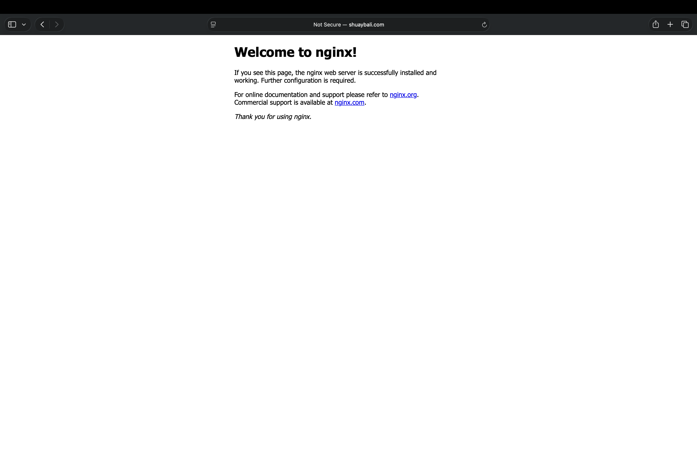
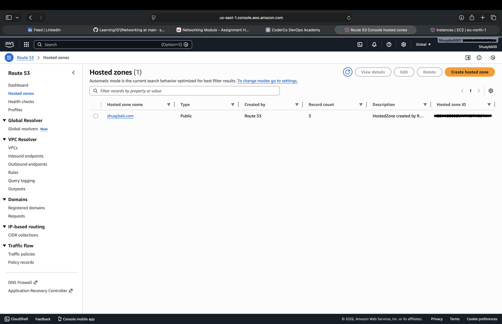

# Networking – EC2 + Route 53

## What I built
- Launched an EC2 instance running NGINX
- Allowed HTTP traffic on port 80
- Bought a domain (shuaybali.com)
- Created a Route 53 A record pointing the domain to the EC2 public IP

## What I learned
- Applied AWS networking fundamentals in a real deployment scenario
- What an A record is and how DNS maps a domain to an IP
- How public IPs enable internet access to instances

## Commands used
- sudo apt install nginx
- sudo systemctl enable nginx
- sudo systemctl start nginx

## Result
- Visiting shuaybali.com displays the NGINX default page

## Website Result

## DNS Configuration

