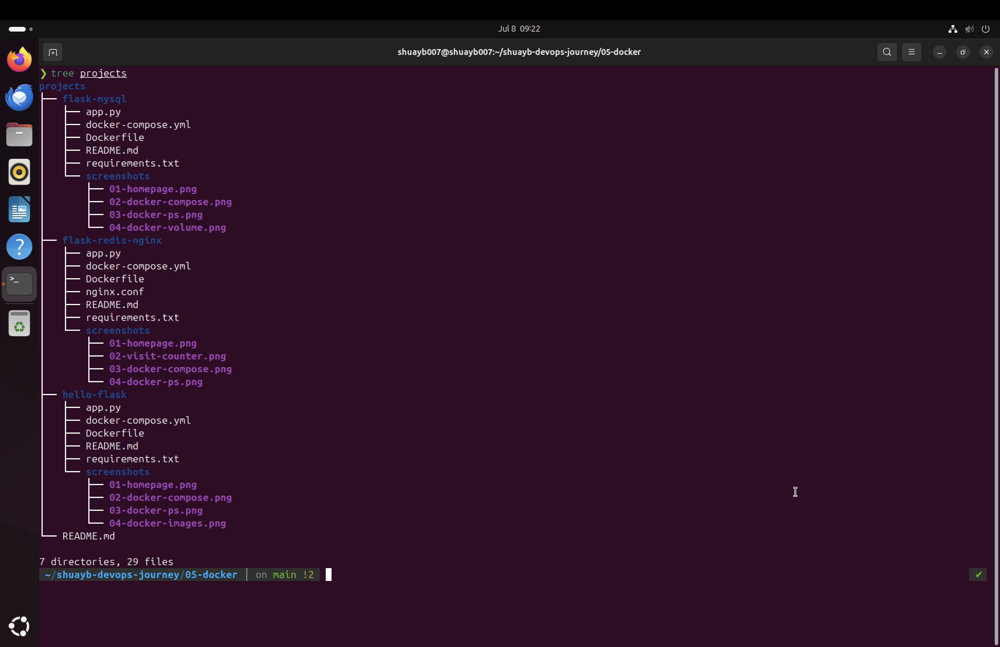

# Docker Projects

This directory contains practical Docker projects that demonstrate progressively more advanced containerisation techniques and multi-service application architectures.

---

## Project Overview

---

## Projects

### hello-flask

A single-container Flask application introducing Docker fundamentals, image creation and container management.

---

### flask-mysql

A multi-container application demonstrating communication between a Flask application and a MySQL database using Docker Compose.

---

### flask-redis-nginx

A multi-service application using Flask, Redis and NGINX to demonstrate service communication, reverse proxying and container orchestration.

---

## Concepts Demonstrated

- Docker Images & Containers
- Dockerfiles
- Docker Compose
- Container Networking
- Docker Volumes
- Environment Variables
- Health Checks
- Multi-container Applications
- Reverse Proxy with NGINX

---

## Purpose

Apply Docker concepts by building applications that demonstrate containerisation, service communication and modern application architecture.

