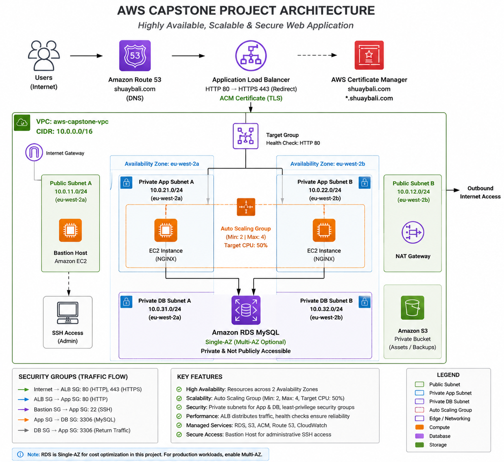
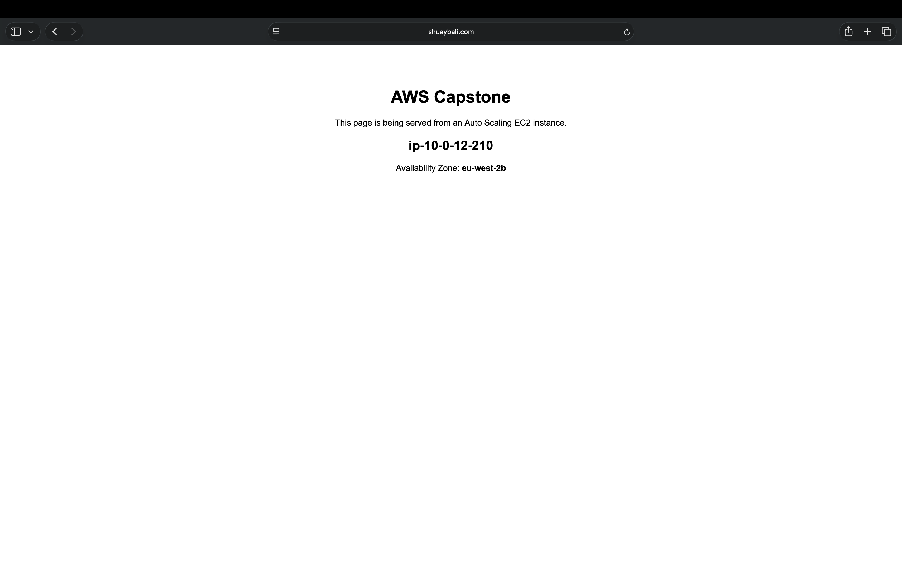
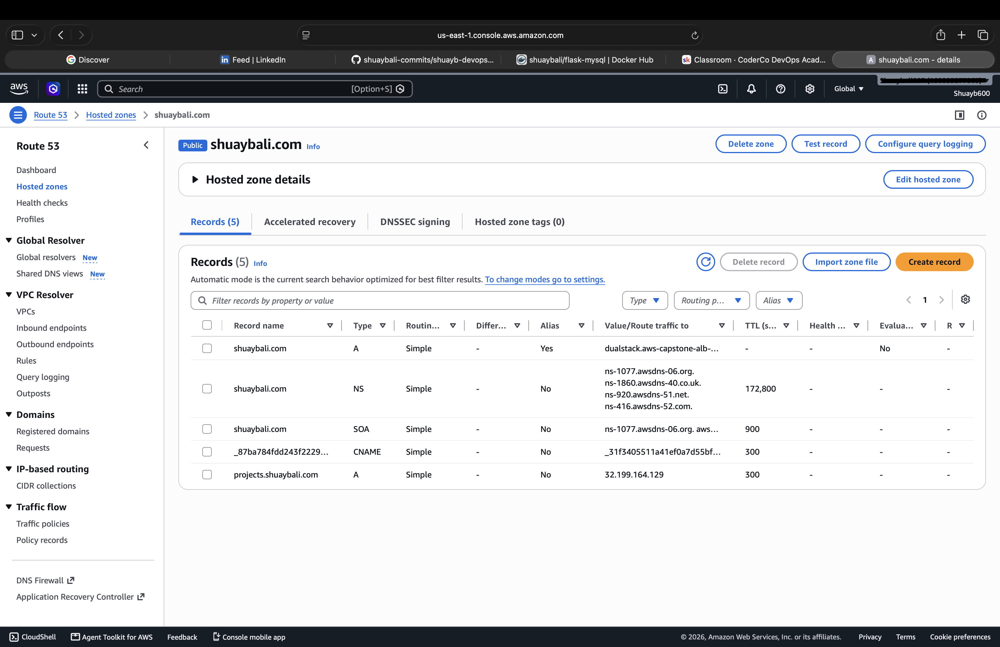
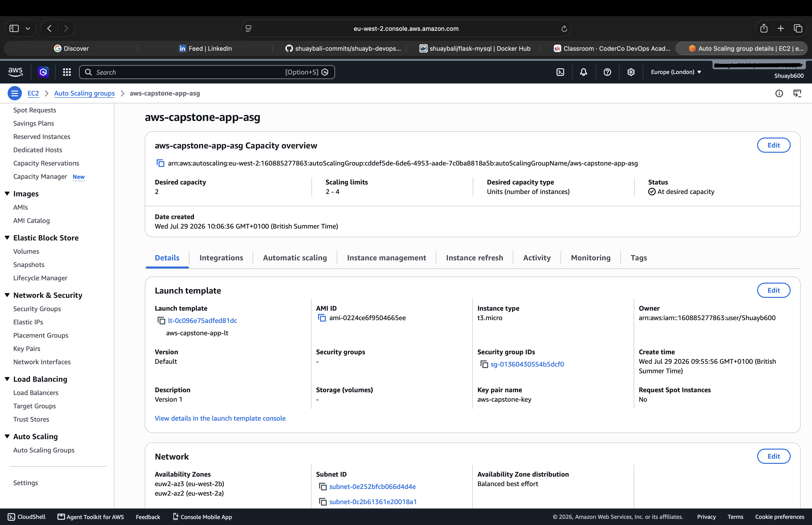
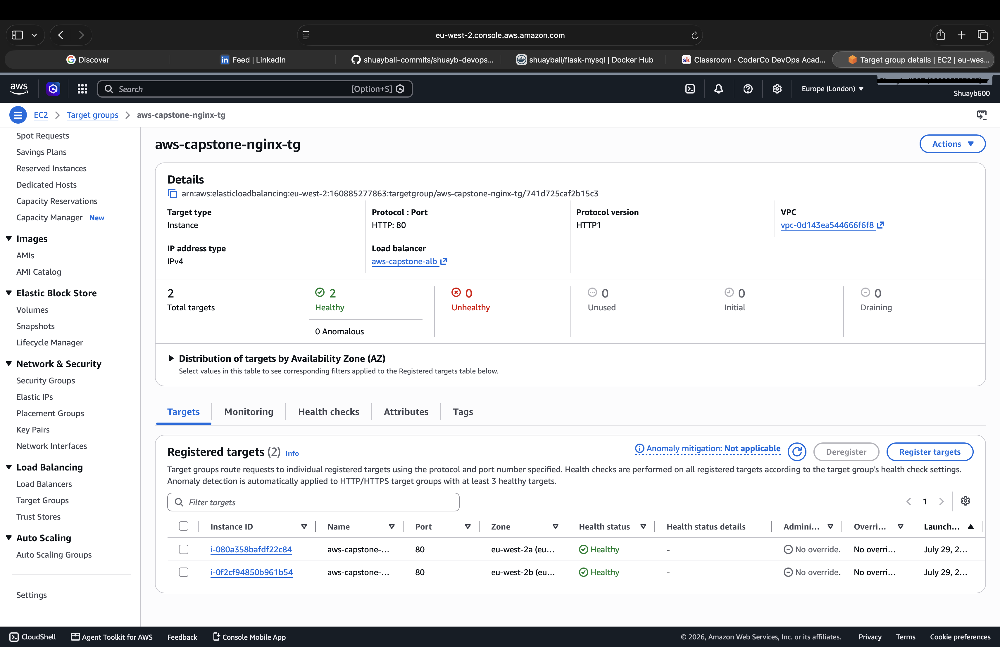
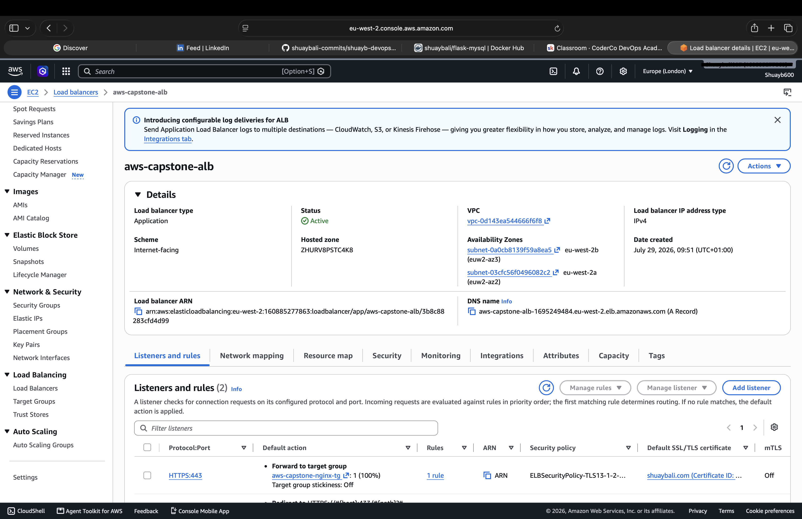

# AWS Highly Available Web Application

> **Production-inspired infrastructure project demonstrating high availability, scalability and secure networking on AWS.**

**Status:** ✅ Completed

---

## Architecture

---

## Overview

This project demonstrates the deployment of a highly available, scalable and secure web application on AWS using a production-inspired architecture.

The environment was designed using a custom VPC with public and private networking, an internet-facing Application Load Balancer, Auto Scaling EC2 instances, a private Amazon RDS MySQL database and secure HTTPS connectivity through Amazon Route 53 and AWS Certificate Manager.

---

## Infrastructure Overview

- Custom Amazon VPC
- Public & Private Subnets
- Internet Gateway
- NAT Gateway
- Bastion Host
- Application Load Balancer (ALB)
- Auto Scaling Group (ASG)
- Amazon EC2 (NGINX)
- Amazon RDS MySQL
- Amazon Route 53
- AWS Certificate Manager (ACM)
- Amazon S3
- Amazon CloudWatch

---

## Project Timeline

- ✅ Designed the network architecture
- ✅ Built a custom VPC with public and private subnets
- ✅ Deployed NGINX on Amazon EC2
- ✅ Configured an Application Load Balancer
- ✅ Implemented Auto Scaling across two Availability Zones
- ✅ Deployed a private Amazon RDS MySQL database
- ✅ Configured Route 53 and HTTPS using AWS Certificate Manager
- ✅ Validated the complete infrastructure

---

## Key Features

- Highly available application across two Availability Zones
- Automatic traffic distribution using an Application Load Balancer
- Auto Scaling application tier
- Secure HTTPS using AWS Certificate Manager
- Automatic HTTP → HTTPS redirection
- Private application and database subnets
- Managed MySQL database hosted on Amazon RDS
- Bastion Host for secure administrative access
- DNS management using Amazon Route 53

---

## Technologies Used

| Compute | Networking | Security | Storage & Monitoring |
|---------|------------|----------|----------------------|

| Amazon EC2 | Amazon VPC | Security Groups | Amazon RDS |
| Auto Scaling | Application Load Balancer | AWS Certificate Manager | Amazon S3 |
| | Route 53 | IAM | Amazon CloudWatch |

---

### Final Deployment

The application is successfully deployed and accessible securely over HTTPS.

---

### Route 53

Custom domain configured with an Alias record pointing to the Application Load Balancer.

---

### Auto Scaling Group

Application instances are managed by an Auto Scaling Group spanning two Availability Zones.

---

### Target Group

The Application Load Balancer performs continuous health checks and routes traffic only to healthy EC2 instances.

---

### Application Load Balancer

Internet-facing Application Load Balancer configured with HTTP to HTTPS redirection and TLS termination using AWS Certificate Manager.

---

## Future Improvements

This project provides a strong production-inspired foundation and can be extended with:

- Terraform Infrastructure as Code
- CI/CD pipelines using GitHub Actions
- Docker containerisation
- Amazon EKS (Kubernetes)
- Multi-AZ Amazon RDS deployment
- AWS WAF
- Amazon CloudFront CDN

---

## Final Thoughts

This project brought together networking, compute, storage, security and database services into a single AWS environment while reinforcing cloud architecture best practices.

This project serves as the capstone for the AWS module and provides the foundation for the Infrastructure as Code, CI/CD and Kubernetes projects that follow in this repository.
