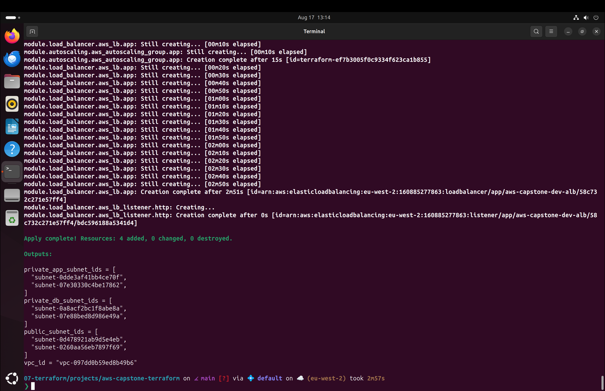
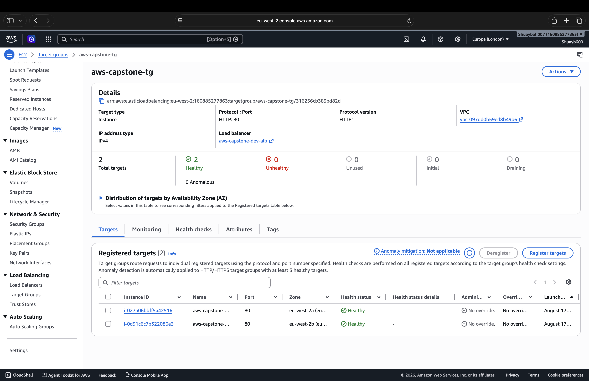
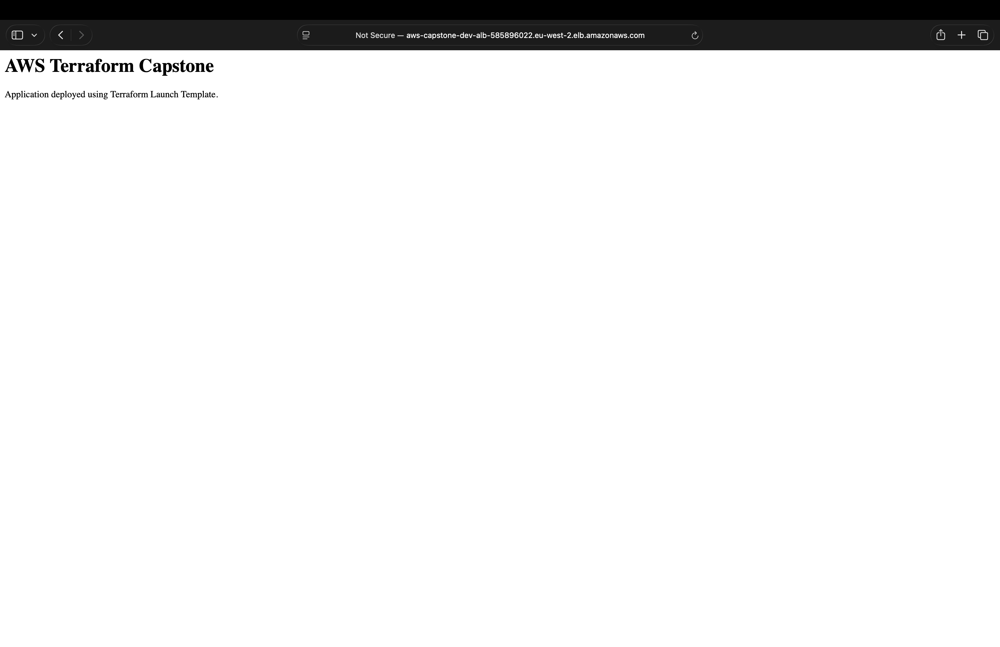

# AWS Capstone – Terraform

> Production-inspired AWS infrastructure built with reusable Terraform modules.


---

## Overview

This project provisions a highly available AWS environment using Terraform and Infrastructure as Code (IaC).

### Features

- Modular Terraform architecture
- Custom VPC across 2 Availability Zones
- Public & Private Subnets
- Internet & NAT Gateways
- Bastion Host
- Application Load Balancer
- Auto Scaling Group
- Launch Template + User Data
- Least-Privilege Security Groups

---

## Architecture


---

## Modules

| Module | Purpose |
|---------|---------|
| Networking | VPC, Subnets, Routing |
| Security | Security Groups |
| Compute | Bastion & Launch Template |
| Load Balancer | ALB, Target Group, Listener |
| Auto Scaling | Auto Scaling Group |

---

## Technologies

- Terraform
- AWS
- EC2
- VPC
- Auto Scaling
- Application Load Balancer
- Security Groups
- Launch Templates

---

## Screenshots

| Terraform | Infrastructure | Application |
|-----------|---------------|-------------|
|  |  |  |

More screenshots are available in the `/screenshots` directory.

---

## Deployment

```bash
terraform init
terraform plan
terraform apply
```

Destroy resources when finished:

```bash
terraform destroy
```

