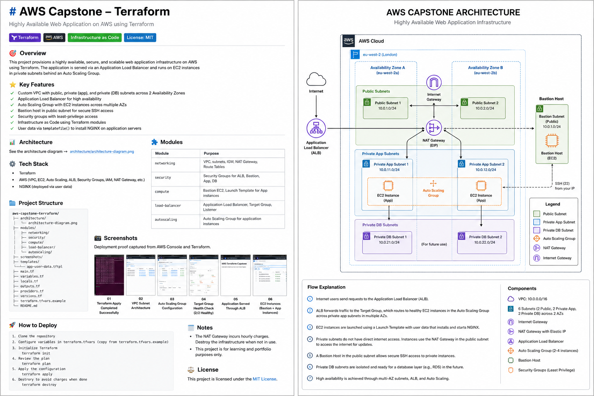

# AWS Capstone – Terraform

> **Production-inspired AWS infrastructure provisioned using Terraform and Infrastructure as Code (IaC).**

**Status:** ✅ Completed

---

## Overview

This project recreates the AWS Capstone infrastructure using Terraform, demonstrating how Infrastructure as Code (IaC) can be used to provision, manage and version cloud infrastructure.

The solution uses reusable Terraform modules to deploy a highly available AWS environment with automated networking, compute, load balancing and Auto Scaling.

---

## Features

- Modular Terraform architecture
- Custom VPC across two Availability Zones
- Public and Private Subnets
- Internet Gateway and NAT Gateway
- Bastion Host
- Application Load Balancer (ALB)
- Auto Scaling Group (ASG)
- Launch Template with User Data
- Least-Privilege Security Groups

---

## Architecture



---

## Module Structure

| Module        | Purpose                                 |
| ------------- | --------------------------------------- |
| Networking    | VPC, Subnets, Route Tables and Gateways |
| Security      | Security Groups                         |
| Compute       | Bastion Host and Launch Template        |
| Load Balancer | ALB, Target Group and Listener          |
| Auto Scaling  | Auto Scaling Group                      |

---

## Technologies Used

- Terraform
- AWS
- Amazon EC2
- Amazon VPC
- Application Load Balancer
- Auto Scaling
- Launch Templates
- Security Groups

---

## Skills Demonstrated

- Infrastructure as Code (IaC)
- Modular Terraform design
- AWS networking
- Reusable infrastructure modules
- Variable and output management
- Launch Templates and User Data
- High Availability architecture
- Infrastructure automation

---

## Deployment

Initialise Terraform:

```bash
terraform init
```

Preview infrastructure changes:

```bash
terraform plan
```

Provision the infrastructure:

```bash
terraform apply
```

Destroy the infrastructure when finished:

```bash
terraform destroy
```

---

## Future Improvements

- Remote state using Amazon S3 and DynamoDB
- Automated deployments with GitHub Actions
- Dockerised application deployment
- Kubernetes deployment with Amazon EKS
- Monitoring with Amazon CloudWatch
- Secrets management using AWS Secrets Manager
