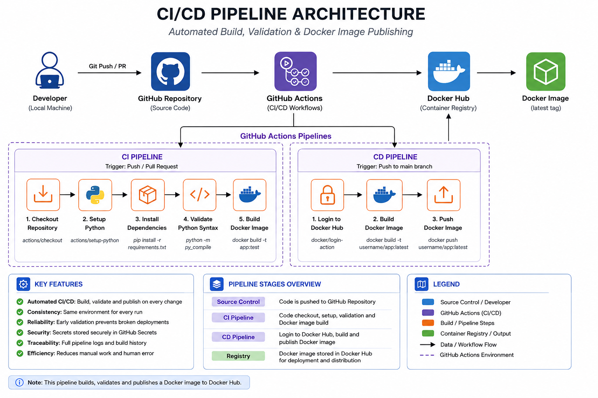

# CI/CD Pipeline

A simple CI/CD pipeline built using GitHub Actions to automatically validate, build and publish a Dockerised Flask application.

---

## Technologies

- Git
- GitHub
- GitHub Actions
- Python
- Flask
- Docker
- Docker Hub

---

## Architecture

---

## Pipeline Overview

The pipeline is split into two workflows.

### Continuous Integration

Runs automatically on every push and pull request.

It:

- Checks out the repository
- Sets up Python
- Installs dependencies
- Validates the application
- Builds the Docker image

### Continuous Deployment

Runs on pushes to the `main` branch.

It:

- Logs in to Docker Hub using GitHub Secrets
- Builds the Docker image
- Publishes the latest image to Docker Hub

---

## Project Structure

CICD-pipeline/
├── .github/workflows
│   ├── ci.yml
│   └── cd.yml
├── app.py
├── Dockerfile
├── requirements.txt
├── architecture/
├── screenshots/
└── README.md

---

## Skills Demonstrated

- Continuous Integration (CI)
- Continuous Deployment (CD)
- GitHub Actions
- Workflow Automation
- Docker
- Docker Hub
- GitHub Secrets
- Python
